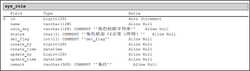
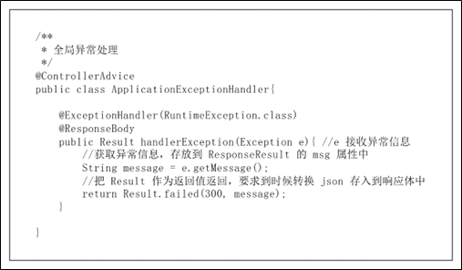
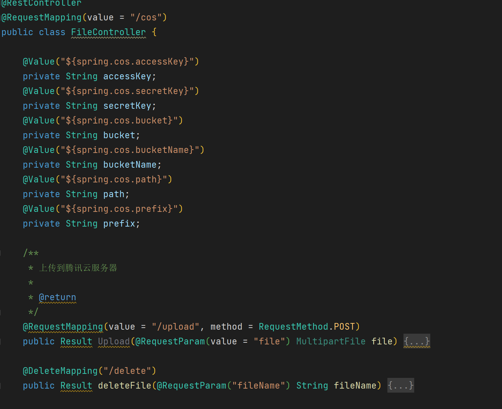

# 概述
该系统是基于RBAC模型的权限管理系统，该权限管理系统对于任何用户都是适用的，用户可以通过该系统快速开发集成权限管理模块的后台管理系统。


##  RBAC 权限模型

简单来说就是用户拥有当前角色的对应权限，一个用户可以有多个角色，每个角色可以有多个菜单，菜单对应着权限。


## 技术栈

* 前端 Vue3 、Vue-Router路由、Pinia状态管理、Ant Design Vue 组件库
* 后端 SpringBoot、SpringSecruity、JWT、MyBatis-Plus、MySQL、Redis缓存，腾讯云COS存储

#  系统设计

##  系统架构

服务运行在Tomcat服务器中，通过Mapper数据访问层访问数据库，Service业务逻辑层调用数据访问层接口来进行业务逻辑的处理，Controller请求处理层接收用户的请求调用业务逻辑层的接口进行处理并返回相应的信息。


##  应用架构

系统的应用架构如图所示，后端开发框架使用SpringBoot、SpringSecurity、MyBatis-Plus，前端开发框架使用Vue3、Ant Design Vue组件库。系统的存储使用MySQL存储关系表数据，使用Redis存储缓存数据，文件存储在腾讯云Cos对象存储中。基础服务包括用户的登录认证，内容安全，权限。业务分为用户管理，角色管理，菜单管理和个人中心。系统的工程化，后端采用Maven来组织项目，前端采用Npm引入包、Vite来搭建Vue单页面应用。稳定性通过在线的系统监控，监控系统的运行情况，来处理风险。


##  系统功能模块

系统的整体功能模块如图所示，首先是动态路由，用户登录后，会自动获取用户的角色信息，通过角色信息获取该角色的菜单信息，动态将菜单信息添加到路由中，然后在首页右侧导航菜单进行渲染展示。个人中心包括用户信息的展示、修改和密码的修改。系统管理包括用户管理、角色管理、菜单管理，能够进行增删改查和用户、角色、菜单的联动。系统监控主要监控系统的CPU、内存、硬盘的使用率，系统的相关信息，JVM（Java虚拟机）的运行情况。


##  数据库设计

本系统的数据库基于RBAC权限模型进行设计，如图所示为系统的数据库E-R图，有三张主要表：用户表、角色表、菜单表和这三张表的关联表：用户角色关联表、角色菜单关联表。用户可以有多个角色，一个角色可以操作多个菜单，菜单对应了相应的操作权限。





##  项目结构

后端项目结构


前端项目结构


##  前后端交互

###  接口设计


前端的HTTP请求方式如上图所示，后端的Controller控制处理器遵循该规范。


后端的接口设计如上图所示，当前端发送请求到后端时，后端进行处理后如图所示的JSON数据。code代表状态码，如200代表ok，401代表无权限等。success代表请求是否成功, msg代表请求返回的提示信息，data代表请求返回的数据，可以携带字符串、数组、集合等数据。


通过创建枚举类封装常见的返回状态码和提示信息，如上图所示。

###  异常处理

Java程序运行时如果出现异常通常会抛出一个异常打印在控制台，由于该系统采用的是前后端分离进行开发，那么请求后后端服务出现异常的话，前端接收不到提示信息，这样的话不利于前后端的交互。我们可以定义全局的异常处理器，如果出现异常就获取异常信息进行封装返回给前端进行提示。



如上图所示，通过@ContollerAdvice注解标注一个类，使其成为全局异常处理器，并实现handleException方法。通过ExcpetionHandler注解标注方法处理的异常类型（RuntimeException.class运行时异常）。通过@ResponseBody注解标注方法，使其返回响应信息。方法的参数e用于接收程序抛出的异常信息，然后进行封装，返回给前端。


如上图所示，我们只要手动抛出异常，就会触发全局的异常处理，将错误信息返回给前端。

##  登录流程

该系统的登录流程如图所示，首先用户发送登录请求，然后服务器校验用户名密码是否正确。如果正确产生token，然后存入到redis中，并设置过期时间，然后返回结果。如果错误，提示用户账号或密码错误，请重试。


##  访问流程

该系统的访问流程如图所示，用户发送访问资源请求，然后服务器校验token。如果token解析失败或者过期，则提示用户重新登录。如果解析成功，则允许返回具体资源。


##  表格设计与实现

如下图所示为系统用户管理界面，主要功能有获取用户分页数据、添加用户、删除用户、通过关键词搜索用户。

 

通过封装自定义Vue组件实现通用的增删改查表格模板，后端只需开发相应的增删改查接口进行对接即可完成功能，无需重复写前端代码。

 

如下图所示，假如SystemUser.vue页面引入YTable组件，只需要在SystemUser.vue页面中向YTable.vue组件传入如图4-12所示的组件属性和自定义事件即可。这样只需关系相应的属性和自定义事件而不需要重复的写前端代码，实现复用。

 

如下图所示的角色管理和菜单管理，就是按照图4-12的流程进行快速开发的。

     

 

#  页面展示


头部的左侧的LOGO，右侧的操作按钮。左侧的菜单，中间的显示区。


用户管理


<div style="display:flex;">
	
	
</div>


角色管理


<div style="display:flex;">
   
    
</div>


菜单管理


<div style="display:flex;">
    
    
</div>


系统监控


#  本地运行

克隆项目

```sh
git clone https://github.com/yangyixiang-cc/yanghi-cms.git
```

##  后端运行

***

首先导入项目根目录下的 `data/sql` 下的 `cms.sql`  文件到 `MySQL` 数据库中。

***

选中 `cms-server`文件， 然后选择从 `IDEA/eclipse` 打开项目（使用 `IDEA` 演示）：

首先你需要打开`pom.xml` 文件加载依赖，然后打开 `application.yml` 文件，修改数据库配置和 `redis` 配置。

***

注意：如果你有腾讯云`COS` 对象存储桶，那么只需配置 `application.yml`  文件中 `spring.cos` 下的配置即可。

 

如果你没有腾讯云 `COS` 对象存储桶，那么你需要自动实现 `com.example.sstest.controller.FileController` 类的两个方法，实现文件的上传和删除。



然后运行项目即可。

##  前端运行

选中 `cms-front` 文件夹选择从 `Vscode`  或命令行窗口打开（使用 `Vscode`演示）：

首先打开终端，执行 `npm install`  命令，安装依赖项。

***

然后打开 `/src/utils/request.js`  文件：修改项目请求地址为你启动的后端地址。


然后使用 `npm run dev` 命令运行项目即可。

测试账号：

* 用户名：yangyihi
* 密码：yangyihi2001

#  反馈

如果您有任何反馈，请通过发送至[电子邮件](mailto:workyyx@163.com)与我联系/或者提交`issues` 。
